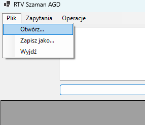
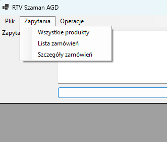
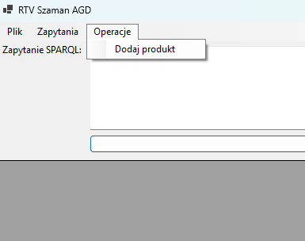
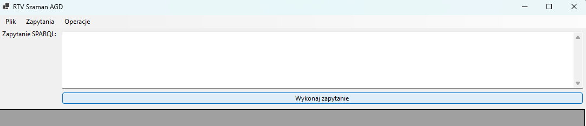
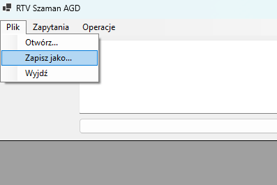
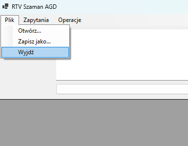

# RTV Szaman

Projekt ten prezentuje przedstawienie ontologii zamówień sprzetów AGD dla klientów indywidualnych. 

## Spis treści

1. [Jak uruchomić projekt](#jak-uruchomić-projekt)
2. [Jak działa aplikacja](#jak-działa-aplikacja)
3. [Dokumentacja Ontologii](#dokumentacja-ontologii)
   - [Struktura Ontologii](#struktura-ontologii)
      - [Właściwości Obiektowe (Object Properties)](#właściwości-obiektowe-object-properties)
      - [Właściwości Dane (Datatype Properties)](#właściwości-dane-datatype-properties)
      - [Klasy (Classes)](#klasy)
      - [Indywidua (Individuals)](#indywidua-individuals)
   - [Opis Techniczny](#opis-techniczny)

## Jak uruchomić projekt

Do uruchomienia aplikacji wymagana jest zainstalowany runtime .NET 8.

1. `cd src/`
2. `dotnet run .\Szaman.csproj`

lub można otworzyć solucję `src/Szaman.sln` w Visual Studio i uruchomić aplikację.

## Jak działa aplikacja

1. Wczytaj plik `rdf` za pomocą Menu: `Plik` > `Otwórz`

2. Obok w zakładce `Zapytania` znajdują się zapytania

3. W zakładce `Operacje` można dodać produkt do naszej ontologii

4. W polu można wykonać zapytanie w języku SPARQL. Zatwierdzamy naciskając komende `Wykonaj zapytanie`

5. Zapisywanie pliku z dodananą ontologią odbywa się w zakładce `Zapisz jako...`. 

6. Wyjście z aplikacji umożliwia przycisk `Wyjdź`

## Dokumentacja Ontologii

### Struktura Ontologii

#### Właściwości Obiektowe (Object Properties)

| Nazwa                  | Domeny                      | Zakresy                          | Opis                                  |
|------------------------|----------------------------|----------------------------------|---------------------------------------|
| `maProduktWPozycji`    | `PozycjaZamowienia`        | `Produkt`                        | Łączy pozycję zamówienia z produktem. |
| `oplaconePrzez`        | `Zamowienie`               | `MetodaPlatnosci`                | Wskazuje metodę płatności dla zamówienia. |
| `wyslanePrzez`         | `Zamowienie`               | `SposobDostawy`                  | Łączy zamówienie z metodą dostawy.    |
| `zawieraPozycje`       | `Zamowienie`               | `PozycjaZamowienia`              | Łączy zamówienie z jego pozycjami.    |
| `zlozonePrzez`         | `Zamowienie`               | `Klient`                         | Wskazuje klienta, który złożył zamówienie. |
| `znajdujeSieNaZamowieniu` | `PozycjaZamowienia`      | `Zamowienie`                     | Łączy pozycję zamówienia z zamówieniem. |

---

#### Właściwości Dane (Datatype Properties)

| Nazwa               | Domeny                | Zakresy           | Opis                                     |
|---------------------|-----------------------|-------------------|------------------------------------------|
| `Cena`              | `Produkt`            | `decimal`         | Cena produktu.                          |
| `DataZamowienia`    | `Zamowienie`         | `dateTimeStamp`   | Data złożenia zamówienia.               |
| `Ilosc`             | `PozycjaZamowienia`  | `integer`         | Ilość produktów w pozycji zamówienia.   |
| `Nazwa`             | `Produkt`            | `string`          | Nazwa produktu.                         |
| `Opis`              | `Produkt`            | `string`          | Opis produktu.                          |
| `WartoscZamowienia` | -                    | `decimal`         | Całkowita wartość zamówienia.           |

---

#### Klasy

| Nazwa              | Opis                                          |
|--------------------|----------------------------------------------|
| `Klient`           | Reprezentuje klienta systemu e-commerce.     |
| `MetodaPlatnosci`  | Reprezentuje metody płatności.               |
| `PozycjaZamowienia`| Pojedyncza pozycja zamówienia.               |
| `Produkt`          | Produkt dostępny w systemie.                 |
| `SposobDostawy`    | Reprezentuje sposoby dostawy zamówień.       |
| `Zamowienie`       | Zamówienie złożone przez klienta.            |

---

#### Indywidua (Individuals)

| Nazwa                | Klasa                | Dodatkowe Właściwości                                 |
|----------------------|----------------------|------------------------------------------------------|
| `AnnaNowak`          | `Klient`            | -                                                    |
| `JanKowalski`        | `Klient`            | -                                                    |
| `KartaKredytowa`     | `MetodaPlatnosci`   | -                                                    |
| `Kurier`             | `SposobDostawy`     | -                                                    |
| `LaptopX1`           | `Produkt`           | Cena: 5000.0, Nazwa: "Laptop Gamingowy"             |
| `Paczkomat`          | `SposobDostawy`     | -                                                    |
| `PayPal`             | `MetodaPlatnosci`   | -                                                    |
| `PowerAudioJBL`      | `Produkt`           | Cena: 1000.0, Nazwa: "Głośnik"                      |
| `PozycjaZamowienia1` | `PozycjaZamowienia` | Produkt: LaptopX1, Ilość: 1, Znajduje się na zamówieniu: Zamowienie2 |

---

### Opis Techniczny

Ontologia została zapisana w formacie RDF/XML zgodnie ze specyfikacją OWL 2. Wykorzystuje następujące przestrzenie nazw:

- `rdf`: http://www.w3.org/1999/02/22-rdf-syntax-ns#
- `rdfs`: http://www.w3.org/2000/01/rdf-schema#
- `owl`: http://www.w3.org/2002/07/owl#
- `xsd`: http://www.w3.org/2001/XMLSchema#

Każdy element ontologii został zaprojektowany w celu reprezentacji realnych procesów w systemie e-commerce, takich jak składanie zamówień, wybór metody dostawy oraz płatności.

